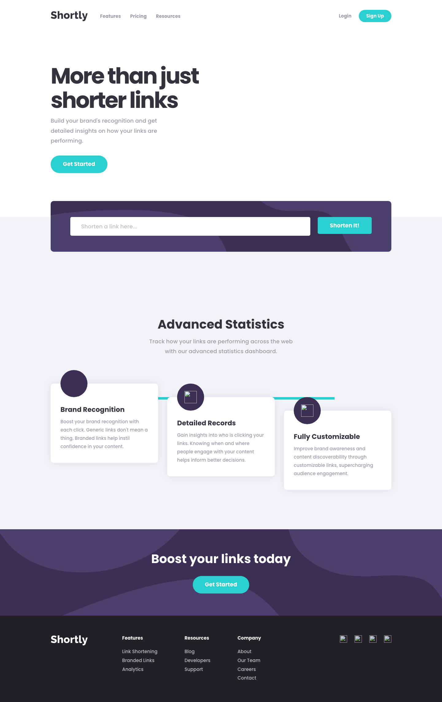

# Shortly — URL Shortening API Landing Page

A responsive landing page for a URL shortening service, built as a [Frontend Mentor](https://www.frontendmentor.io/challenges/url-shortening-api-landing-page-2ce3ob-G) challenge. Integrates with the [CleanURI API](https://cleanuri.com/docs) to shorten links, persists results in `localStorage`, and includes one-click clipboard copy with visual feedback.


---

## Table of Contents

- [Overview](#overview)
  - [The Challenge](#the-challenge)
  - [Screenshots](#screenshots)
  - [Links](#links)
- [My Process](#my-process)
  - [Built With](#built-with)
  - [What I Learned](#what-i-learned)
  - [Continued Development](#continued-development)
  - [Useful Resources](#useful-resources)
  - [AI Collaboration](#ai-collaboration)
- [Project Structure](#project-structure)
- [Installation](#installation)
- [Tests](#tests)
- [Roadmap](#roadmap)
- [Author](#author)
- [Acknowledgments](#acknowledgments)

---

## Overview

### The Challenge

Users should be able to:

- View the optimal layout for the site depending on their device's screen size
- Shorten any valid URL using the CleanURI API
- See a list of their shortened links, even after refreshing the browser (persisted in `localStorage`)
- Copy the shortened link to their clipboard in a single click
- Receive an error message when the form is submitted with an empty input field

### Screenshots

| Desktop (1440px) | Mobile (375px) |
|---|---|
|  |  |

### Links

- **Solution:** [github.com/gusanchefullstack/fsdev-url-shortening-api-landing-page](https://github.com/gusanchefullstack/fsdev-url-shortening-api-landing-page)
- **Live Site:** [fsdev-url-shortening-api-landing-pa.vercel.app](https://fsdev-url-shortening-api-landing-pa.vercel.app)

---

## My Process

### Built With

- **React 19** with TypeScript — component architecture, hooks, `useId`, `useRef`
- **Vite 8** — dev server with API proxy (avoids CORS on CleanURI), production build
- **CSS Modules** — scoped styles, no class-name collisions
- **CSS Custom Properties** — all design tokens (colors, spacing, typography) in `variables.css`
- **CleanURI API** — URL shortening via `POST /api/v1/shorten`
- **localStorage** — persistent shortened link history across page refreshes
- **Vitest + Testing Library** — unit and integration tests, jsdom environment
- Mobile-first responsive design from 375px → 1440px

### What I Learned

**Vite 8 + Vitest type conflict.** Vite 8 switched its bundler to Rolldown internally, which ships different TypeScript types than the `vite` package that Vitest 3 bundles. Using `defineConfig` from `vitest/config` in the same config file causes a `Plugin<any>` type mismatch. The fix: split into two config files — `vite.config.ts` (uses `defineConfig` from `vite`) and `vitest.config.ts` (uses `defineConfig` from `vitest/config` with `plugins: [react() as never]` to silence the cross-version type incompatibility).

**CORS and API proxying.** The CleanURI API returns CORS errors when called directly from a browser on a different origin. In development, Vite's built-in proxy rewrites `/api/shorten` → `https://cleanuri.com/api/v1/shorten`. For production on Vercel, the same path is handled by a serverless function, keeping the request server-side and bypassing CORS entirely.

**localStorage with React state.** A generic `useLocalStorage<T>` hook reads initial state from storage on mount and keeps React state and storage in sync on every write — so the shortened link list survives page refreshes with zero extra `useEffect` wiring in components.

**Accessible form validation.** Rather than relying on the browser's native `:invalid` pseudo-class (which fires on first render), validation fires only on submit. The error message is linked to the input via `aria-describedby` and carries `role="alert"` so screen readers announce it immediately without focus movement.

**Staggered card layout with CSS.** The three feature cards on desktop are offset vertically (0 / 2.75rem / 5.5rem) using CSS class variants, with a horizontal `::before` pseudo-element as the connecting line — no JS positioning needed. On mobile the stagger collapses and the connector becomes vertical.

### Continued Development

- Add keyboard trap and focus management for the mobile navigation menu
- Animate the shortened links list entry (staggered slide-in)
- Add ability to delete individual shortened links from history
- Add a Vercel Edge Function as a durable proxy with rate-limit handling

### Useful Resources

- [CleanURI API Docs](https://cleanuri.com/docs) — the URL shortening endpoint used in this project
- [Vite Server Proxy](https://vite.dev/config/server-options.html#server-proxy) — setting up the dev-time proxy to bypass CORS
- [Testing Library — user-event](https://testing-library.com/docs/user-event/intro) — simulating realistic user interactions in tests
- [MDN — Clipboard API](https://developer.mozilla.org/en-US/docs/Web/API/Clipboard/writeText) — async clipboard write with graceful `execCommand` fallback
- [CSS Custom Properties Guide](https://css-tricks.com/a-complete-guide-to-custom-properties/) — design token patterns with CSS variables

### AI Collaboration

This project was built with [Claude Code](https://claude.ai/code) (Claude Sonnet 4.6) as an AI pair programmer.

- **Planning:** Analyzed Figma design files and reference images to produce a full implementation plan covering component architecture, design tokens, API strategy, git branching, and commit order — before writing any code.
- **Implementation:** Generated all components, CSS Modules, hooks, and tests in sequence. The AI identified the Vite 8 / Vitest 3 type incompatibility during the first build check and proposed the split-config fix.
- **Testing:** Tests were written alongside implementation. The AI debugged `localStorage.clear is not a function` (jsdom needed a manual mock in `setup.ts`) and the `navigator.clipboard` getter-only error (fixed with `vi.spyOn` instead of `Object.assign`).
- **What worked well:** Upfront planning → sequential commits → build check after each step kept bugs isolated and easy to fix.

---

## Project Structure

```
src/
├── components/
│   ├── Header/           # Nav bar with responsive hamburger menu
│   ├── Hero/             # Hero section with illustration
│   ├── UrlShortener/     # Shortener form + results list + copy button
│   ├── Statistics/       # Feature cards with connecting line
│   ├── Boost/            # CTA section
│   └── Footer/           # Footer with link columns + social icons
├── hooks/
│   ├── useLocalStorage.ts  # Generic localStorage ↔ React state sync
│   └── useUrlShortener.ts  # CleanURI API call + error handling
├── styles/
│   ├── variables.css       # All design tokens (colors, spacing, typography)
│   └── global.css          # Reset + base styles + Poppins font
├── test/
│   ├── setup.ts            # jsdom localStorage + clipboard mocks
│   ├── UrlShortener.test.tsx
│   └── ShortenedLink.test.tsx
└── types/
    └── index.ts            # ShortenedLink interface
```

---

## Installation

**Prerequisites:** Node.js ≥ 18, npm ≥ 9

```bash
# Clone the repository
git clone https://github.com/gusanchefullstack/fsdev-url-shortening-api-landing-page.git
cd fsdev-url-shortening-api-landing-page

# Install dependencies
npm install

# Start the dev server (includes API proxy for CleanURI)
npm run dev
```

Open [http://localhost:5173](http://localhost:5173) in your browser.

---

## Tests

Uses **Vitest** with **Testing Library** and a jsdom environment.

```bash
npm test            # Run all tests (9 specs)
npm run test:watch  # Watch mode
```

Coverage areas:
- Form validation — empty submit shows error, `aria-invalid` set, error clears on type
- API integration — fetch mock, `localStorage` persistence after shortening, API error display
- Copy button — text changes to "Copied!", `clipboard.writeText` called with the shortened URL

---

## Roadmap

- [x] Responsive layout (375px / 768px / 1440px)
- [x] URL shortening via CleanURI API
- [x] localStorage persistence across page refreshes
- [x] One-click copy with "Copied!" feedback
- [x] Empty input validation with accessible error message
- [x] Vitest test suite (9 tests)
- [x] Deployed to Vercel
- [ ] Delete individual links from history
- [ ] Keyboard trap + focus management for mobile menu
- [ ] Animated link list entry (staggered slide-in)
- [ ] Vercel Edge Function proxy with rate-limit handling

---

## Author

[](https://www.linkedin.com/in/gustavosanchezgalarza/)
[](https://github.com/gusanchefullstack)
[](https://www.frontendmentor.io/profile/gusanchefullstack)
[](https://x.com/gusanchedev)
[](https://bsky.app/profile/gusanchedev.bsky.social)
[](https://hashnode.com/@gusanchedev)
[](https://www.freecodecamp.org/gusanchedev)

---

## Acknowledgments

- [Frontend Mentor](https://www.frontendmentor.io) for the challenge design and assets
- [CleanURI](https://cleanuri.com) for the free URL shortening API
- [Poppins](https://fonts.google.com/specimen/Poppins) by Indian Type Foundry, served via Google Fonts
